# Fraud AI Portfolio

4 production-grade AI/ML projects for banking fraud detection, spanning RAG, MLOps deployment, multi-agent orchestration, and LLM fine-tuning.

Built by [Ahmad Whafa Azka Al Azkiyai](https://github.com/alazkiyai09)

## Projects

| # | Project | Tech Stack | Live Demo |
|---|---|---|---|
| 1 | [FraudShield RAG Agent](https://github.com/alazkiyai09/fraudshield-rag) | LangChain, Qdrant, FastAPI, Docker | `https://fraudshield-api-xxxxx-as.a.run.app/docs` |
| 2 | [MedicaidGuard Deploy](https://github.com/alazkiyai09/medicaidguard-deploy) | XGBoost, GCP Cloud Run, GitHub Actions | `https://medicaidguard-api-xxxxx-as.a.run.app/docs` |
| 3 | [Fraud Agent Monitor](https://github.com/alazkiyai09/fraud-agent-monitor) | LangGraph, LangSmith, RAGAS, Streamlit | `https://fraud-monitor.streamlit.app` |
| 4 | [Fraud LLM Fine-tune](https://github.com/alazkiyai09/fraud-llm-finetune) | QLoRA, Mistral-7B, PEFT, HuggingFace | `https://huggingface.co/spaces/alazkiyai09/fraud-llm` |

## System Architecture

```mermaid
graph TB
    subgraph "Project 1: FraudShield RAG"
        A[Document Ingestion] --> B[Qdrant Vector Store]
        B --> C[RAG Query Engine]
        C --> D[FastAPI /query]
    end

    subgraph "Project 2: MedicaidGuard"
        E[Transaction Data] --> F[XGBoost Pipeline]
        F --> G[FastAPI /predict]
        G --> H[SHAP Explanations]
    end

    subgraph "Project 3: Multi-Agent Monitor"
        I[Transaction Stream] --> J[Transaction Analyzer]
        J --> K[Pattern Detector]
        K --> L[Risk Scorer]
        L --> M[Report Generator]
        M --> N[LangSmith Traces]
    end

    subgraph "Project 4: Fraud LLM"
        O[Fraud Narratives] --> P[QLoRA Fine-tuning]
        P --> Q[Mistral-7B Adapter]
        Q --> R[HuggingFace Spaces]
    end
```



## Skills Demonstrated

- GenAI/LLM: RAG, LangChain, LangGraph, prompt engineering, QLoRA
- ML Engineering: XGBoost, SHAP, evaluation pipelines, model packaging
- Infrastructure: Docker, Cloud Run, GitHub Actions CI/CD
- APIs: FastAPI, Pydantic, production API contracts
- Observability: LangSmith tracing, RAGAS evaluation, metrics endpoints

## Quick Start

```bash
git clone https://github.com/alazkiyai09/fraudshield-rag.git
git clone https://github.com/alazkiyai09/medicaidguard-deploy.git
git clone https://github.com/alazkiyai09/fraud-agent-monitor.git
git clone https://github.com/alazkiyai09/fraud-llm-finetune.git
```

Deployment and execution checklist: [`docs/LAUNCH_EXECUTION.md`](docs/LAUNCH_EXECUTION.md)
